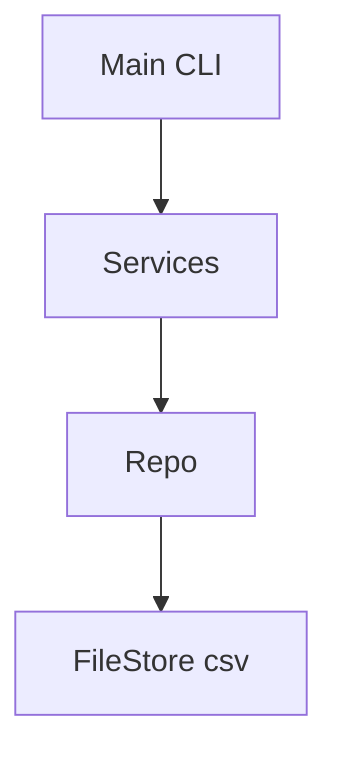
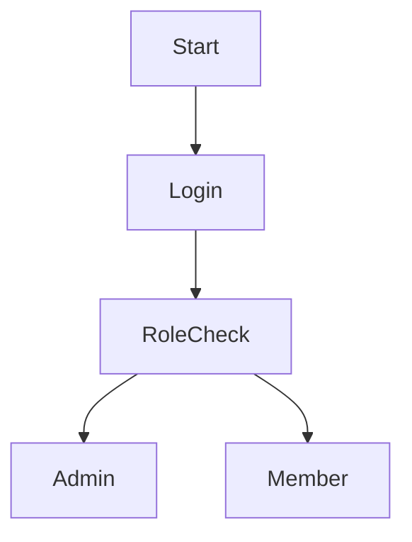
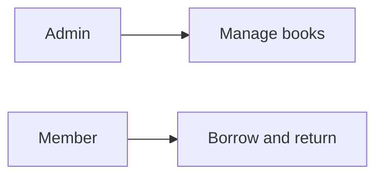
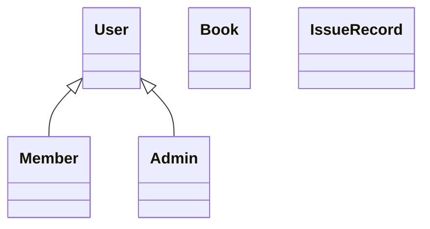
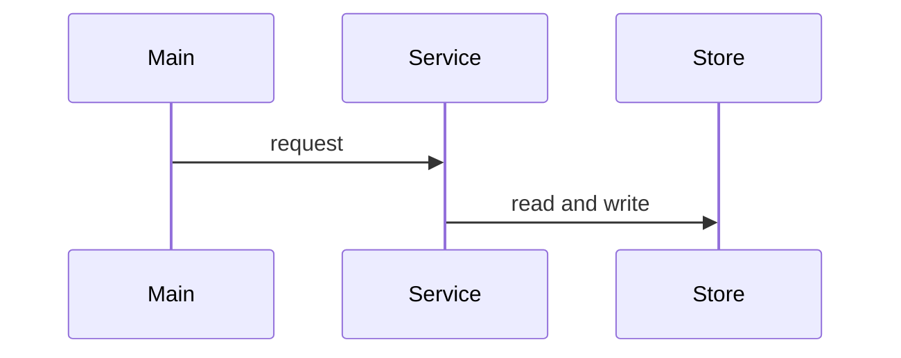
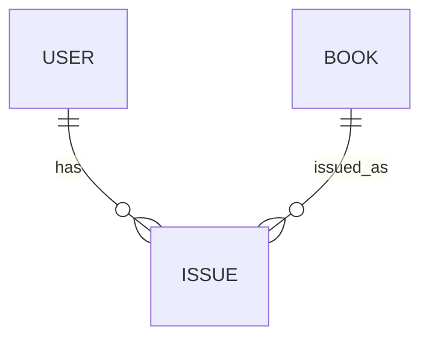

# Design

Authoritative spec for Library Management System CLI. `statement.md` holds problem, scope, users and high-level features. This file adds objectives, requirements, architecture, workflows, UML and storage.

## Problem statement

See [../statement.md](../statement.md). Short summary only here.

<!-- TODO -->

## Objectives

<!-- TODO: 4 bullets, measurable where possible -->

- 

## Functional requirements

<!-- TODO: include input, pre-condition, post-condition per FR -->

### User management

- FR1:
- FR2:

### Catalog and circulation

- FR3:
- FR4:

### Reporting and analytics

- FR5:
- FR6:

Input/output structure:

| Input | Processing | Output |
|---|---|---|
|  |  |  |

## Non-functional requirements

At least four required. Current list:

- Performance:
- Security:
- Usability:
- Reliability:
- Maintainability:
- Logging and error handling:

<!-- TODO: fill with targets and how verified -->

## System architecture diagram

<!-- TODO: mermaid graph TD, Main -> Services -> Repo -> FileStore -->

## Process flow and workflow diagram

<!-- TODO: flowchart for login, admin flow, member issue and return -->

## UML diagrams

### Use case diagram

<!-- TODO: actors Admin and Member, include authenticate -->

### Class diagram and component diagram

<!-- TODO: User, Member, Admin, Book, IssueRecord, services, store -->

### Sequence diagram

<!-- TODO: two flows - issue book and return book -->

## Database and storage design

File based csv, swappable to RDBMS.

### ER diagram

<!-- TODO: User, Book, Issue entities and relations -->

### Schema design

<!-- TODO: tables, keys, constraints -->

- users(id, username, password_hash, role)
- books(id, title, author, copies, available)
- issues(id, book_id, member_id, issued_at, due_at, returned_at, fine)

Constraints:

- 
