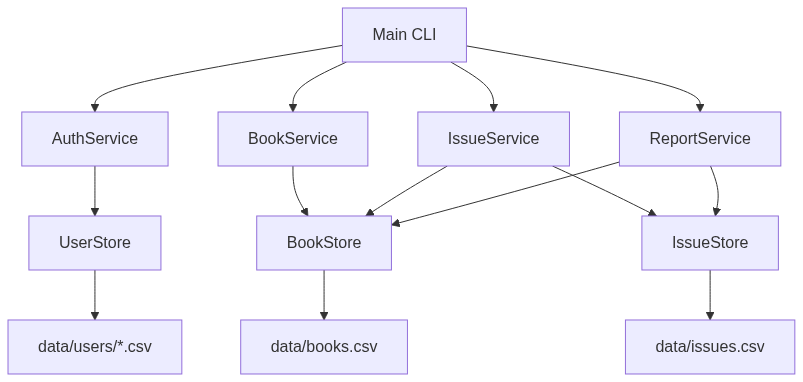
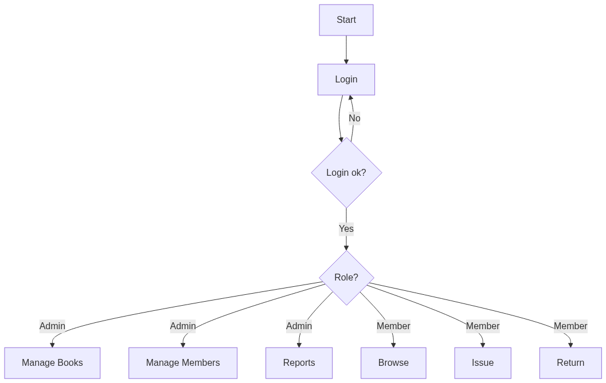
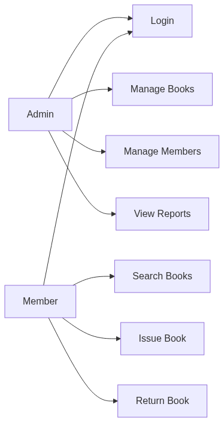
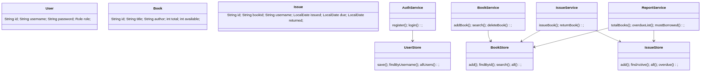
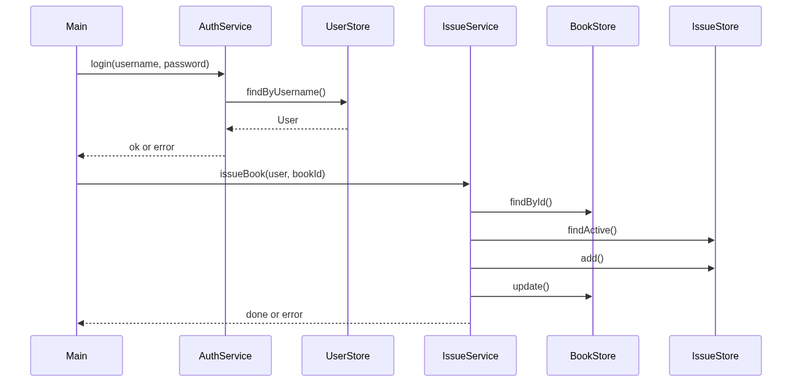
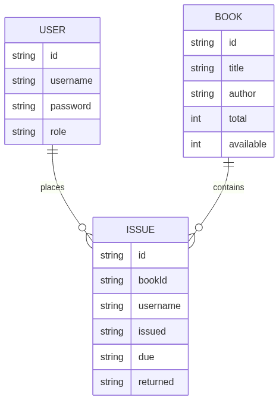

# Design

## Problem statement

See statement.md. In short, library needs simple software to keep books and issue records without manual register.

## Objectives

- Make login and register easy
- Let admin add and manage books
- Let students issue and return books
- Show simple reports

## Functional requirements

### User management

- FR1: Register new member with username and password
- FR2: Login with username and password, check role
- FR3: Admin can create member and librarian accounts
- FR4: Show list of users

### Catalog and circulation

- FR5: Admin can add book with id, title, author, copies
- FR6: Admin can edit and delete book
- FR7: Anyone can search books by title or author
- FR8: Member can issue book if copy is available and limit not crossed
- FR9: Member can return book and get fine if late

### Reporting and analytics

- FR10: Show total books and copies
- FR11: Show overdue list
- FR12: Show most borrowed book

Input/output structure:

| Input | Processing | Output |
|---|---|---|
| username, password | check in UserStore | success or error |
| book id, title, author, copies | save in books.csv | list shows new book |
| member and book id for issue | check copies and limit | issued or error |
| member and book id for return | check active issue | returned or late fine |

## Non-functional requirements

- Performance: search and login use files, works fast for small data (100 books)
- Security: plain text password in csv, role check before admin work
- Usability: simple menu, clear messages, re-prompt on wrong input
- Reliability: if csv missing it is created, bad line is skipped
- Maintainability: separate packages for model, repo, service
- Logging: simple console messages

## System architecture diagram

## Process flow and workflow diagram

## UML diagrams

### Use case diagram

### Class diagram

### Sequence diagram

## Database and storage design

Files in data folder, gitignored.

### ER diagram

### Schema design

- users: `data/users/<username>.csv` -> `username,password,role,id,createdAt`
- books: `data/books.csv` -> `id,title,author,total,available`
- issues: `data/issues.csv` -> `id,bookId,username,issued,due,returned`

Example:

- `admin,admin123,ADMIN,a1,2026-09-18`
- `B001,Intro to Java,Herbert Schildt,5,5`
- `abc123,B001,alice,2026-09-18,2026-10-02,`

Constraints:

- username is file name, must be unique
- book id must be unique
- issue is active if returned is empty
